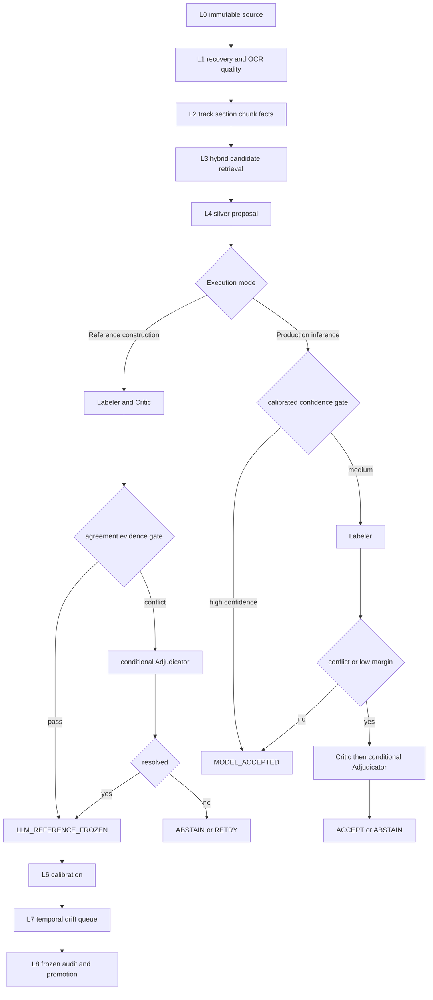

# P4 로컬 LLM 에이전트 기반 NCS Reference 구축·계층형 매핑·선택적 예측 보정 시스템 최종 설계서

- **버전:** v4.0
- **작성일:** 2026-08-06
- **문서 상태:** `IMPLEMENTATION_BASELINE_CANDIDATE`
- **운영 판정:** `PATCH_BEFORE_SNAPSHOT_FREEZE`
- **시스템 설계 판정:** `APPROVE_WITH_STRICT_AUTHORITY_BOUNDARIES`
- **적용 범위:** P4 M1.5 의미 계층 복원 → M2 production corpus → M3 frozen reference/audit·model promotion
- **기준 계약:** `P4_CONTRACT_v2.1.2` + `P4_SEMANTIC_NCS_REFERENCE_ADDENDUM_v4.0`
- **권고 차기 계약:** `P4_CONTRACT_v2.1.3`
- **정본 정책:** `DuckDB/Parquet = machine canonical`, `CSV = 사용자 검수·전달용 export`
- **기본 실행 프로파일:** `LOCAL_OSS_STRICT`
- **보조 실행 프로파일:** `HYBRID_PRIVACY_SPLIT`, `CLOUD_MODEL_STRICT`
- **공식 명칭 정책:** 인간 독립검증이 없는 라벨은 `LLM_REFERENCE`로 저장한다. `LLM-Gold`는 문서·코드 호환용 legacy alias일 뿐 외부 성능 주장에 사용하지 않는다.

---

## 0. 문서 권한과 확정 결정

### 0.1 문서 역할

본 문서는 다음 세 문서를 대체하지 않고 상위 구현 기준으로 통합한다.

```text
P4_CONTRACT_v2.1.2
= canonical table·field·Notebook 실행계약

P4_Notebook_First_기능명세_데이터활용_기획서_v1.0
= crawl·pipeline·ncs_mapping Notebook 실행기획

P4_SEMANTIC_NCS_REFERENCE_ADDENDUM_v4.0
= 의미 복원·NCS corpus·LLM reference·calibration·audit 계약
```

충돌 시 증거 우선순위는 다음과 같다.

```text
1. 원천 bytes와 SHA-256
2. immutable release manifest
3. Git commit·Notebook blob SHA
4. 실행 stage artifact
5. 테스트 결과
6. 감사보고서
7. Agent 요약
```

### 0.2 현재 운영상태

```text
M1_OBSERVED_EXECUTION            = PASS_WITH_FINDINGS
OBSERVED_SNAPSHOT_FROZEN         = BLOCKED
M1.5_SEMANTIC_QA                 = NOT_STARTED
M2_PRODUCTION_CRAWL              = BLOCKED
DATA_READY_RQ1_RQ2A              = BLOCKED
DATA_READY_RQ2B                  = BLOCKED
ANALYSIS_READY                   = BLOCKED
```

현재 observed-development는 24개 source Notebook, 234 cells, 24/24 실행, 388/388 artifact SHA 일치와 CSV↔Parquet 구조 검증을 입증한다. 그러나 동일 bundle ID의 lineage 불일치, stale·duplicate manifest, Master dependency order, validator false-pass 가능성, 날짜·enum·career/intern·NCS level 미완성 때문에 snapshot 동결과 production 승격은 금지한다.

### 0.3 구현 방향

다음 결정을 v4.0의 기본 구현 방향으로 둔다.

```text
D-ORCH-001 = C
현재 observed snapshot 동결을 보류하고 새 dataVersion으로 재생성한다.

D-ORCH-002 = A
검증된 Agent 3 control-plane HEAD를 integration baseline으로 사용하되 실행 전 최신 remote 상태를 재검증한다.

D-ORCH-003 = A
M1.5 semantic QA를 M2 full crawl보다 먼저 수행한다.

D-ORCH-004 = A 권고
production 기간은 2020-01~2026-07, 2019 제외. 실제 network crawl은 별도 사용자 승인 후 실행한다.

D-ORCH-005 = A 권고
Linkareer-hosted 핵심 asset만 수집·OCR하고 외부 ATS transport는 금지한다.
```

---

## 1. Executive Summary

### 1.1 Executive verdict

> **`PATCH_BEFORE_SNAPSHOT_FREEZE`**

P4의 병목은 Notebook 존재나 export 형식이 아니라 의미변수와 authority다. 따라서 구현순서는 모델 도입보다 control·API contract·canonicalization을 앞세운다.

```text
M1.5-P  External API contract probe
+ M1.5-0 Authority & control repair
→ M1.5-A Deterministic semantic recovery
→ M1.5-B OCR & structure pilot
→ M1.5-C Reference infrastructure
→ M1.5-D Hybrid retrieval·calibration benchmark
→ M2 Full crawl·production preprocessing
→ M3 Frozen temporal audit·model promotion
```

### 1.2 핵심 변경점

v4.0은 v3.0의 설계를 다음과 같이 보완한다.

1. API endpoint·필드명을 구현 가정으로 취급하지 않고 `contract probe → raw fixture → parser test`를 선행한다.
2. NCS를 평면 코드표가 아니라 versioned node·edge graph와 duty-unit bridge로 canonicalize한다.
3. `ncsCorpusVersion`, `aliasVersion`, `parserVersion`, `indexVersion`의 발행 조건을 분리한다.
4. 날짜·코드·수치·공식 NCS level에는 LLM 사용을 금지한다.
5. 인간 검증이 없는 산출물은 `LLM_REFERENCE`로 명명하고 외부 정확도 지표와 분리한다.
6. Reference 구축과 production inference의 LLM 호출정책을 분리한다.
7. Candidate packet의 크기·필드·truncation 규칙을 명시한다.
8. OCR 품질을 단일 confidence가 아닌 layout·문자·순서·HTML agreement 벡터로 평가한다.
9. Development 2020~2024, validation 2025, frozen temporal audit 2026의 시간 분할을 기본으로 한다.
10. RQ2-B의 multi-label, 반복언급, required/preferred/duty, abstain 분모를 명시적으로 고정한다.

### 1.3 비동치 원칙

```text
LLM_REFERENCE_FROZEN
≠ HUMAN_GOLD_FROZEN
≠ 객관적 정답
≠ 지원자 개인의 숙련도
≠ 실제 직무성과
≠ AI 인과효과의 증거
```

---

## 2. Objectives & Research Design

### 2.1 시스템 목표

P4는 Linkareer 공고 원문과 NCS·Work24 직무 데이터를 결합해 다음을 측정 가능한 데이터로 만든다.

- 신입·인턴·경력 공고구조
- 진입장벽과 필수·우대 요구조건
- 인턴 담당업무의 NCS 직무·능력단위·공식 수준 band
- HTML·ActivityText·이미지 공고의 복원 가능 범위
- NCS Top-3 retrieval, final mapping, calibration, abstention의 신뢰도

### 2.2 연구질문

#### RQ1 — 공고구조

2020-01~2026-07 Linkareer 유효공고에서 신입·인턴·경력 포함 여부와 배타적 구성은 시점·직무별로 어떻게 달라졌는가.

주요 지표:

```text
entryPostingRate
internPostingRate
entryOnlyShare
internOnlyShare
mixedShare
experiencedOnlyShare
```

#### RQ2-A — 진입장벽

명목 신입·인턴 공고에서 필수 경력, 사전경험, 프로젝트, 포트폴리오, 자격증, 학위, 전공, 근무 가능 기간 요구는 시점·직무별로 어떻게 달라졌는가.

주요 지표:

```text
openEntryShare(E0)
restrictedEntryShare(E1)
restrictedInternShare(I1)
minCareerMonths
requirementType별 required/preferred 비율
```

#### RQ2-B — 직무·업무수준

인턴 담당업무·지식·기술 chunk는 NCS상 어느 직무·능력단위에 대응하며, 공식 수준 1~8과 band 분포는 시점·직무별로 어떻게 달라졌는가.

```text
B1 = level 1~2
B2 = level 3~4
B3 = level 5~6
B4 = level 7~8
```

### 2.3 Measurement Questions

#### MQ1 — Source recovery

HTML·ActivityText·Linkareer-hosted image를 결합했을 때 duty·required·preferred 구조를 어느 coverage와 품질로 복원할 수 있는가.

#### MQ2 — Retrieval·mapping

NCS Top-3 후보를 어느 정도 회수하며, final mapping을 어느 risk·coverage 수준에서 채택할 수 있는가.

#### MQ3 — Reference stability

LLM Labeler·Critic·조건부 Adjudicator가 시간·직무·source mode별로 어느 정도 일관성을 보이며, disagreement·abstention이 어디에 집중되는가.

### 2.4 허용·금지 추론

허용:

```text
기술통계
기간별·집단별 차이
패턴
상관
조건부 연관성
LLM-reference agreement
risk–coverage
모델 간 disagreement
```

금지:

```text
AI가 신입채용을 감소시켰다
AI 때문에 기업이 신입을 인턴으로 대체했다
NCS level이 개인의 실제 숙련도다
LLM 합의가 사실 정확성을 보장한다
LLM_REFERENCE를 인간 Gold와 동일하게 표현한다
```

---

## 3. Architecture

### 3.1 L0~L8 계층

| Layer | 명칭 | 역할 | 대표 산출물 | 승격조건 |
|---|---|---|---|---|
| L0 | Immutable Source | Linkareer·NCS·Work24 raw bytes 보존 | raw HTML/XML/JSON/image, SHA manifest | checksum·source policy |
| L1 | Source Recovery | HTML·ActivityText·OCR 복원 | sourceBlock, OCR bbox, quality vector | lineage·mapping eligibility |
| L2 | Semantic Structure | posting→track→section→chunk→fact | section, chunk, requirementFact | enum·boundary·evidence |
| L3 | Retrieval | sparse+dense+Work24+hierarchy 후보검색 | Top-K candidates | code validity·Recall@K |
| L4 | Silver Proposal | deterministic·weak-label 제안 | silver_proposals | provenance·no forced mapping |
| L5 | Reference Coding | LLM/Human coding·critique·adjudication | reference_labels | evidence·independence·freeze |
| L6 | Calibration | score→probability, threshold, abstention | calibration model | validation-only fit |
| L7 | Active Review | 저신뢰·drift·hard negative queue | review queue | leakage control |
| L8 | Audit & Promotion | frozen temporal audit·release 승격 | model card, resultManifest | fail-closed gate |

### 3.2 Authority boundary

| 작업 | 1차 authority | LLM 권한 | 금지사항 |
|---|---|---|---|
| 게시일·기간 | raw HTML/API·deterministic parser | 없음 | 날짜 생성·보정 금지 |
| code 유효성 | canonical NCS corpus | 없음 | code 발명 금지 |
| 공식 NCS level | `ncs_ability_unit` metadata | 없음 | 텍스트에서 level 추론 금지 |
| 경력 연수·학위·자격증 | regex/parser | 오류탐지·모호성 설명 | 명시값 덮어쓰기 금지 |
| 명시적 section header | DOM/regex structure | 손상·누락 시 보조 | 구조 근거 없는 재분류 금지 |
| 직무·능력단위 의미매핑 | hybrid retrieval | 후보 선택·기각·근거 | canonical 후보 밖 code 생성 금지 |
| 최종 매핑 보류 | calibrated rule | evidence 검토 보조 | confidence 단독 확정 금지 |
| artifact write·promotion | wrapper/control plane | 없음 | LLM 직접 파일쓰기·승격 금지 |

### 3.3 전체 흐름



### 3.4 Canonical authority

```text
Raw authority         = immutable bytes + SHA manifest
Processing authority  = DuckDB + Parquet
Reference authority   = frozen reference release manifest
Model authority       = model registry + artifact SHA
Prompt authority      = prompt registry + prompt SHA
CSV                   = inspection/export only
```

---

## 4. External Dependencies & API Contract Probe

### 4.1 원칙

외부 API 명세의 endpoint·parameter·field 예시는 **실측 전까지 provisional**이다. 구현자는 제공 문서의 필드명을 곧바로 canonical schema로 하드코딩하지 않는다.

필수 구현순서:

```text
contract registry
→ smoke probe
→ raw success/error fixture
→ observed response schema
→ parser fixture test
→ normalized adapter
→ corpus ingest
```

### 4.2 M1.5-P API contract probe

각 endpoint에 대해 다음 케이스를 실행한다.

| Probe | 입력 | 기대 산출 |
|---|---|---|
| SUCCESS_MINIMAL | 최소 정상 parameter | raw response·observed schema |
| SUCCESS_PAGINATED | page 1·2 또는 limit 변화 | pagination contract |
| EMPTY_VALID | 존재하지 않는 정상 code/word | empty semantics |
| INVALID_PARAMETER | 잘못된 code·page | error envelope |
| AUTH_MISSING | key 제거 | auth error fixture |
| AUTH_INVALID | 폐기·invalid test key | auth error fixture |
| FORMAT_VARIANT | XML/JSON option | content type·schema drift |

모든 request는 secret을 제거한 canonical form으로 hash한다.

```text
requestUrlRedacted
requestParameterJsonRedacted
requestSha256
httpStatus
contentType
retrievedAt
rawResponsePath
rawResponseSha256
observedSchemaSha256
parserVersion
contractStatus
```

### 4.3 NCS OpenAPI registry

- **Base URL:** `https://apis.data.go.kr/B490007/ncsInfo`
- **기본 포맷:** 공식 metadata상 REST/XML
- **credential:** `NCS_API_SERVICE_KEY`

Provisional endpoint registry:

| Endpoint | Semantic role | Expected inputs | Contract status |
|---|---|---|---|
| `/ncsCdInfo` | 분류체계·직무코드 entrypoint | serviceKey, pageNo, numOfRows, optional code | `PROBE_REQUIRED` |
| `/ncsDutyInfo` | 직무명·직무정의 후보 | serviceKey, ncsDutyCd | `PROBE_REQUIRED` |
| `/ncsCompeUnitInfo` | 능력단위명·정의·level 후보 | serviceKey, ncsDutyCd | `PROBE_REQUIRED` |
| `/ncsCompeUnitFactrInfo` | 능력단위요소·수행준거 | serviceKey, duty/unit code | `PROBE_REQUIRED` |
| `/ncsKsaInfo` | K/S/A 텍스트 | serviceKey, duty/unit code | `PROBE_REQUIRED` |
| `/ncsjobInfo` | 직업기초능력·하위영역 | serviceKey, documented filters | `OPTIONAL_PROBE` |
| 기타 endpoint | 훈련·평가·적용범위 enrichment | endpoint별 | `OPTIONAL` |

실제 XML path, field name, paging field, error envelope는 probe artifact가 authority다.

### 4.4 Work24 직무데이터사전 registry

Provisional 호출 endpoint:

```text
https://www.work24.go.kr/cm/openApi/call/wk/callOpenApiSvcInfo215L11.do
```

Provisional parameters:

```text
authKey
word
limit
returnType
```

예상 용도:

- 직무·업무 문구에서 NCS 능력단위 후보 확장
- 현업 표현·약어·직무명 alias 구축
- NCS OpenAPI canonical corpus와 crosswalk

필수 통제:

1. Work24 result의 `ablt_unit` 등 code는 canonical NCS corpus와 교차검증한다.
2. code가 없거나 일치하지 않으면 새 canonical code를 생성하지 않는다.
3. `canonicalizationStatus = MATCHED | UNMATCHED | AMBIGUOUS | INVALID`로 남긴다.
4. Work24는 retrieval enrichment이며 Gold/reference authority가 아니다.
5. 문자열 공백·오탈자 민감성을 고려해 query normalization과 원문 query를 함께 저장한다.

### 4.5 외부 dependency failure policy

```text
HTTP 4xx policy violation → immediate stop
HTTP 429/5xx              → bounded retry + exponential backoff
schema drift              → quarantine + BLOCKED
secret missing            → NOT_EVALUATED
empty valid response      → EMPTY_VALID, not PASS/FAIL
partial pagination        → coverage incomplete
silent content-type drift → FAIL
model unavailable         → no silent model fallback
```

### 4.6 Runtime dependency

| Component | 역할 | 통제 |
|---|---|---|
| Python 3.12.x | pipeline·agent wrapper | exact minor lock |
| DuckDB | canonical analytical DB | exact version |
| PyArrow/Parquet | columnar artifact | exact version |
| httpx | external fetch | timeout·retry wrapper |
| nbclient | Notebook execution | declared dependency |
| JSON Schema | structured output | Draft 2020-12 |
| OCR engine | image recovery | engine·lang pack pin |
| sparse library | BM25/TF-IDF | tokenizer version |
| embedding/reranker | retrieval | model revision+SHA |
| local/cloud LLM | semantic review | model revision+prompt SHA |

---

## 5. Data Model & Schemas

### 5.1 공통 원칙

- 모든 table은 grain, PK, FK, provenance, version을 명시한다.
- deterministic ID는 SHA-256 기반으로 생성한다.
- raw XML/JSON은 L0에 보존하고 normalized table은 raw pointer를 가진다.
- 빈 데이터의 위반 0건은 `NOT_EVALUATED`다.
- canonical eligibility:

```text
postingEligibleFlag
rq1EligibleFlag
rq2EligibleFlag
ncsEligibleFlag
```

- `validPostingFlag`는 canonical에서 금지한다.
- `highDemandScore`는 전 행 `NULL`이다.

### 5.2 API contract tables

#### `api_endpoint_contract`

- **Grain:** provider×endpoint×contractVersion
- **PK:** `apiContractId`

```text
provider
baseUrl
endpointPath
httpMethod
expectedContentTypesJson
parameterSchemaJson
contractStatus = PROVISIONAL | PROBED | FROZEN | DRIFTED | RETIRED
observedSchemaSha256
fixtureManifestSha256
parserVersion
validFrom
validTo
```

#### `api_probe_run`

- **Grain:** endpoint×probe case×run
- **PK:** `apiProbeRunId`

```text
apiContractId
probeCase
requestSha256
requestParametersRedactedJson
httpStatus
contentType
responseClass = SUCCESS | EMPTY_VALID | AUTH_ERROR | PARAM_ERROR | SERVER_ERROR
rawResponseSha256
observedSchemaSha256
startedAt
completedAt
status
```

#### `api_raw_response`

- **Grain:** HTTP response 1건
- **PK:** `apiResponseId`

```text
provider
endpointPath
requestSha256
rawResponsePath
rawResponseSha256
contentLength
retrievedAt
sourceReleaseId
```

### 5.3 Source recovery·OCR

#### `source_block`

```text
sourceBlockId PK
postingId FK
rawPostingId FK
assetId FK nullable
sourceMode = HTML | ACTIVITY_TEXT | OCR | MERGED
sourceText
startChar
endChar
pageNo
bboxJson
rawSha256
parserVersion
```

#### `ocr_quality`

- **Grain:** asset×OCR run
- **PK:** `ocrQualityId`

```text
assetId
ocrRunId
ocrEngine
ocrEngineVersion
ocrCharCount
ocrKoreanRatio
ocrGarbageCharRate
ocrLineOrderConfidence
ocrDuplicateOverlapRate
layoutType = POSTER | TABLE | BULLET | MIXED | UNKNOWN
htmlOcrTextAgreement
meanEngineConfidence
ocrEligibleForStructure
ocrEligibleForMapping
qualityReasonCodesJson
```

`ocrEligibleForMapping=false`이면 NCS 확정매핑을 금지하고 `INSUFFICIENT_EVIDENCE` 또는 `OCR_FAILED`로 종료한다.

#### `semantic_chunk`

```text
chunkId PK
trackId FK
sectionId FK
sourceBlockId FK
chunkType = DUTY | REQUIREMENT | KNOWLEDGE | SKILL | COMPETENCY_EXPERIENCE | PROCESS | OTHER
chunkText
normalizedText
ncsMappableFlag
chunkingVersion
```

### 5.4 NCS graph·canonicalization

#### `ncs_corpus_release`

```text
ncsCorpusVersion PK
ncsApiSourceReleaseId
work24SourceReleaseId
parserVersion
aliasVersion
retrievedAt
rawManifestSha256
normalizedManifestSha256
status = CANDIDATE | FROZEN | SUPERSEDED
```

#### `ncs_node`

- **Grain:** versioned NCS node
- **PK:** `ncsCorpusVersion × nodeCode × nodeType`

```text
nodeCode
nodeType = LARGE | MIDDLE | SMALL | SUBCATEGORY | DUTY | UNIT | FACTOR | JOB_BASIC
parentNodeCode nullable
officialName
nameSource = OFFICIAL | DERIVED | MISSING
definitionText
officialLevel nullable
validFrom
validTo
sourceEndpoint
sourceSha256
```

#### `ncs_edge`

- **Grain:** versioned node relation

```text
fromNodeCode
toNodeCode
edgeType = PARENT_OF | CONTAINS | ASSOCIATED_WITH | FUSED_WITH
sourceEndpoint
sourceSha256
isActive
```

#### `ncs_duty_unit_bridge`

```text
dutyCode
unitCode
relationshipType
sourceEndpoint
sourceSha256
canonicalizationStatus = MATCHED | UNMATCHED | AMBIGUOUS | INVALID
isActive
```

#### `ncs_external_code_crosswalk`

```text
provider = WORK24 | OTHER
externalCode
externalName
canonicalNodeCode nullable
canonicalizationStatus
matchBasis
sourceResponseSha256
crosswalkVersion
```

#### `ncs_ability_unit`

```text
ncsUnitCode PK within corpus version
ncsUnitName
ncsUnitDefinition
ncsLevel  -- official metadata only
ncsBand   -- deterministic B1~B4
subcategoryCode
dutyCodesJson
sourceSha256
```

#### `ncs_corpus_diff`

```text
fromCorpusVersion
toCorpusVersion
changeType = ADDED | REMOVED | NAME_CHANGED | DEFINITION_CHANGED | LEVEL_CHANGED | PARENT_CHANGED | KSA_CHANGED
nodeCode
oldHash
newHash
detectedAt
```

### 5.5 Version policy

| 변경 | 증가 version |
|---|---|
| official unit code 신규·삭제 | `ncsCorpusVersion` |
| official definition·level·parent·KSA 변경 | `ncsCorpusVersion` |
| Work24 alias 추가·변경만 발생 | `aliasVersion` |
| parser 변경·raw snapshot 동일 | `parserVersion` |
| embedding/reranker 변경 | `indexVersion` 또는 `modelVersion` |
| threshold/calibration 변경 | `calibrationVersion` |
| prompt 변경 | `promptVersion` |

동일 version에서 row content 변경을 금지한다.

### 5.6 Candidate packet

#### `candidate_packet`

- **Grain:** annotation task×packet version

```text
candidatePacketId
annotationTaskId
targetTextSha256
targetCharCount
targetTokenCount
sourceRole = DUTY | REQUIRED | PREFERRED | OTHER
contextBlockCount
retrievalTopK
llmVisibleK
truncationPolicyVersion
candidateCodesJson
packetSha256
```

기본 제한:

```text
targetText: 최대 1,200자 또는 tokenizer 기준 600 tokens
sectionContext: 앞뒤 각 1개 block, 총 800자 상한
retrievalTopK: 10
llmVisibleK: rerank 상위 3~5
candidate definition: unit당 350자 상한
performance criteria: unit당 최대 2개
level metadata: 출력검증용으로만 전달, 선택 근거로 사용 금지
```

허용 결정:

```text
SELECT_CANDIDATE
MULTI_LABEL
NONE_OF_CANDIDATES
OUT_OF_SCOPE
ABSTAIN
```

### 5.7 Reference·prediction

#### Reference 상태 머신

```text
UNLABELED
→ SILVER_PROPOSED
→ LLM_CODED or HUMAN_CODED
→ CRITIC_EVALUATED
→ ADJUDICATION_REQUIRED
→ ADJUDICATED
→ LLM_REFERENCE_FROZEN or HUMAN_GOLD_FROZEN or HYBRID_GOLD_FROZEN
→ SUPERSEDED
```

보조 종료상태:

```text
ABSTAINED
OUT_OF_SCOPE
INSUFFICIENT_EVIDENCE
INVALIDATED
```

#### `reference_labels`

```text
referenceLabelId PK
annotationTaskId
referenceAuthority = LLM_REFERENCE | HUMAN_GOLD | HYBRID_GOLD
referenceLabelJson
referenceTier = A | B | C | HUMAN | HYBRID | ABSTAIN
referenceConfidence
referenceStatus
labelerRunId
criticRunId
adjudicatorRunId
humanCodingBundleId nullable
evidenceSpansJson
sourceSha256
candidatePacketSha256
candidateCorpusSha256
promptBundleSha256
frozenAt
supersededBy
```

외부 문서에서 `LLM_REFERENCE`를 단순 `Gold`, `precision`, `accuracy`, `Macro-F1`로 표기하지 않는다.

#### `model_predictions`

```text
predictionId PK
predictionRunId
targetId
candidateCode
candidateRank
sparseScore
denseScore
rerankScore
hierarchyScore
combinedScore
calibratedProbability
predictionStatus = MODEL_ACCEPTED | LLM_REVIEWED | ABSTAIN | OUT_OF_SCOPE | REJECTED
modelVersion
```

### 5.8 RQ2-B marts

#### `ncs_mapping_coverage_mart`

```text
periodMonth
jobCohort
sourceRole
ncsEligibleChunkCount
acceptedSingleCount
acceptedMultiCount
abstainCount
unmappedCount
outOfScopeCount
mappingCoverage
```

#### `ncs_band_distribution_mart`

```text
periodMonth
jobCohort
sourceRole
ncsBand
acceptedWeight
acceptedMappedDenominator
allEligibleDenominator
bandShareAccepted
bandShareEligibleLowerBound
```

---

## 6. Pipeline Stages & Gates

### 6.1 공통 상태

```text
PASS
PASS_WITH_FINDINGS
PARTIAL
BLOCKED
NOT_STARTED
NOT_EVALUATED
FAIL
```

공통 fail-closed:

```text
input SHA mismatch
duplicate PK/orphan FK
schema drift not approved
missing provenance
stale or duplicate current-run manifest
validator execution failure
invalid canonical code
secret exposure
```

### 6.2 M1.5-P — External API Contract Probe

**목적:** NCS·Work24 실제 응답계약을 먼저 고정한다.

| Owner | 입력 | 작업 | 출력 |
|---|---|---|---|
| Agent 4 NCS + Agent 3 Control | user API contract, official metadata, credentials | 5개 핵심 NCS endpoint+Work24 probe | raw fixtures, schemas, parser tests, registry |

Gate:

```text
NCS_API_CONTRACT_PROBED
WORK24_API_CONTRACT_PROBED
API_ERROR_CONTRACT_READY
API_SECRET_LOGGING_ZERO
```

통과조건:

- 핵심 endpoint별 success fixture 1개 이상
- auth error·invalid parameter·empty response fixture 존재
- raw response SHA 100%
- observed field schema와 parser fixture test 존재
- secret 문자열이 artifact·log에 0건

### 6.3 M1.5-0 — Authority & Control Repair

작업:

- 새 `dataVersion`
- crawl/pipeline lineage 불일치 해소
- stage당 current-run manifest 1개
- stale FAILED manifest 격리
- Master topological order
- Agent 2 validator fail-closed
- source Notebook blob SHA binding
- dependency lock

Gate:

```text
OBSERVED_SNAPSHOT_FROZEN
MASTER_ORCHESTRATION_PATCHED
VALIDATOR_FAIL_CLOSED
CURRENT_RUN_ARTIFACT_BOUND
RUNTIME_DEPENDENCIES_LOCKED
```

### 6.4 M1.5-A — Deterministic Semantic Recovery

LLM 없이 처리한다.

```text
canonicalPostedAt
periodMonth
postingKind enum
requirementType enum
obligation
raw file flags
asset period/sourceField
explicit career month/degree/certificate facts
```

Gate:

```text
TIME_SEMANTICS_READY
CANONICAL_ENUM_READY
RAW_LINEAGE_READY
DETERMINISTIC_SEMANTIC_BASE_READY
```

초기 기준:

- `canonicalPostedAt` coverage ≥ 0.98
- `periodMonth` derivation mismatch 0
- canonical enum invalid 0
- raw existence flag mismatch 0

### 6.5 M1.5-B — OCR & Structure Pilot

범위:

- Linkareer-hosted asset
- 기존 OCR 후보 30건
- 외부 ATS fetch 금지

작업:

```text
asset fetch
→ MIME/hash
→ OCR+bbox
→ quality vector
→ HTML/OCR merge
→ section/chunk
→ mapping eligibility
```

Gate:

```text
OCR_PILOT_READY
SOURCE_BLOCK_READY
SECTION_STRUCTURE_PILOT_READY
OCR_MAPPING_ELIGIBILITY_READY
```

### 6.6 M1.5-C — Reference Infrastructure

Reference 구축 모드에서는 sampled task마다 Labeler+Critic을 필수로 하고 Adjudicator는 disagreement 조건부로 호출한다.

Gate:

```text
REFERENCE_SCHEMA_READY
LLM_AGENT_RUNTIME_READY
PROMPT_MODEL_REGISTRY_READY
LLM_REFERENCE_PILOT_READY
```

Runtime 기준:

```text
structuredOutputSuccessRate >= 0.995
unsupportedCanonicalCodeRate = 0
missingEvidenceSpanRate <= 0.02
retryExhaustedRate <= 0.005
```

### 6.7 M1.5-D — Hybrid Retrieval·Calibration Benchmark

실험군:

```text
char TF-IDF
word TF-IDF
BM25
dense embedding
sparse+dense fusion
fusion+reranker
fusion+hierarchy
fusion+Work24 alias
```

Gate:

```text
NCS_CANONICAL_CORPUS_READY
NCS_RETRIEVAL_BENCHMARK_READY
CALIBRATION_READY
SELECTIVE_PREDICTION_READY
TEMPORAL_AUDIT_FRAME_READY
```

### 6.8 M2 — Full Crawl & Production Preprocess

시작조건:

```text
79개월 unverified=0
full index/detail lineage
Linkareer-hosted asset policy PASS
source-policy user approval record
success-rate/403 kill switch PASS
strict validator PASS
M1.5-P/0/A/B critical gates PASS
```

실제 network production 실행은 사용자의 명시적 승인 전까지 금지한다.

### 6.9 M3 — Frozen Audit & Model Promotion

```text
REFERENCE_AUDIT_FROZEN
NCS_MAPPING_REFERENCE_READY
NCS_LEVEL_BAND_READY
MODEL_PROMOTION_READY
MODEL_DERIVED_ANALYSIS_READY
```

승격:

```text
PROMOTED
PROMOTED_WITH_LIMITED_COVERAGE
REJECTED
RETRAIN_REQUIRED
BLOCKED_BY_EVIDENCE
```

---

## 7. LLM Agents

### 7.1 두 실행모드

#### A. Reference construction mode

목적: frozen reference set 구축.

```text
모든 sampled task: Labeler 1 + Critic 1
불일치·저신뢰: Adjudicator 1
미해결: ABSTAIN
```

#### B. Production inference mode

목적: full corpus 비용·지연 통제.

```text
1. deterministic validation + hybrid retrieval
2. high-confidence: LLM 없이 MODEL_ACCEPTED
3. medium-confidence: Labeler 1
4. retrieval/Labeler conflict 또는 low margin: Critic
5. unresolved conflict·OCR risk·OUT_OF_SCOPE conflict: Adjudicator
6. 여전히 불확실: ABSTAIN
```

High-confidence 자동수락은 reference label이 아니라 model prediction이다.

### 7.2 Labeler

허용:

- visible candidate 선택·기각
- multi-label 제안
- evidence span
- `NONE_OF_CANDIDATES`, `OUT_OF_SCOPE`, `ABSTAIN`

금지:

- candidate corpus에 없는 code 생성
- NCS level 직접 추론
- 날짜·경력연수·학위·자격증 명시값 덮어쓰기
- preferred를 required로 승격

### 7.3 Critic

- Labeler 승인 기본값 금지
- evidence support
- tool-only false mapping
- duty/required/preferred 혼합
- candidate miss
- chunk 재분할 필요
- hierarchy consistency

### 7.4 Adjudicator 호출조건

```text
Labeler–Critic disagreement
p_top1 < τ_review
p_top1 - p_top2 < τ_margin
OCR mapping eligibility borderline
candidate miss 의심
OUT_OF_SCOPE conflict
multi-label conflict
source evidence mismatch
```

### 7.5 Candidate packet contract

```text
sourceRole
bounded targetText
bounded adjacent context
retrieval Top-10 metadata
LLM visible Top-3~5
unit code/name/definition
관련 수행준거 최대 2개
original retrieval rank hidden from ordering but preserved as metadata
allowedDecision enum
```

truncation 발생 시 `truncatedFlag=true`, 제거된 문자·token 수를 기록한다. 후보 packet이 limit을 초과하면 silent truncation하지 않고 deterministic summarizer 또는 packet split을 사용한다.

### 7.6 Prompt·model provenance

모든 run:

```text
modelId
modelRevision
modelArtifactSha256
promptVersion
promptSha256
outputSchemaSha256
candidatePacketSha256
candidateCorpusSha256
sourceSha256
parameterSha256
```

### 7.7 모델 선택

평가기준:

```text
한국어 지시이행
structured JSON 성공률
evidence span 정확성
repeat-run stability
context·VRAM·latency
license
revision pin 가능성
```

Labeler와 Critic은 다른 model family를 우선한다. 동일 모델을 사용할 경우 prompt·seed·candidate order를 분리하고 독립성이 제한됨을 기록한다.

---

## 8. NCS Corpus

### 8.1 Corpus 정의

```text
공식 분류체계
+ 직무
+ 능력단위
+ 능력단위요소
+ 수행준거
+ KSA
+ Work24 표현
+ versioned aliases
+ canonical crosswalk
```

### 8.2 구축 순서

```text
API contract probe
→ raw snapshot
→ observed schema validation
→ node/edge canonicalization
→ duty-unit bridge
→ Work24 crosswalk
→ alias release
→ corpus diff
→ immutable corpus freeze
```

### 8.3 Canonicalization 규칙

- 직무코드·세분류코드·능력단위코드를 1:1로 가정하지 않는다.
- source별 code를 별도 보존한다.
- multiple duty-to-unit 관계를 bridge로 저장한다.
- official name null이면 `nameSource=MISSING`이며 derived name을 official로 위장하지 않는다.
- Work24 code 불일치는 `UNMATCHED` 또는 `AMBIGUOUS`로 남긴다.
- NCS official level은 unit metadata로만 채운다.

### 8.4 Corpus release diff

매 release마다 자동 산출:

```text
신규/삭제 unit 수
이름 변경 수
definition/KSA hash 변경 수
level 변경 수
parent 변경 수
crosswalk unmatched 수
alias 신규·삭제 수
```

### 8.5 Core cohort와 retrieval universe

```text
Primary analysis cohort = core 69 후보를 M3 전 freeze
Retrieval universe       = core + adjacent + OUT_OF_SCOPE sentinel
통신 20-02               = sensitivity
방송 20-03               = separate/excluded
```

분석 cohort와 retrieval universe를 동일시하지 않는다.

---

## 9. Retrieval, Calibration & Aggregation

### 9.1 입력 단위

```text
DUTY
KNOWLEDGE
SKILL
COMPETENCY_EXPERIENCE
```

RQ2-A fact와 RQ2-B mapping을 분리한다.

### 9.2 Candidate union


target chunk `i`의 후보집합:

\[
\mathcal C_i =
\operatorname{TopK}_{sparse}
\cup \operatorname{TopK}_{dense}
\cup \operatorname{TopK}_{Work24}
\cup \operatorname{AliasExact}
\cup \operatorname{HierarchyBackoff}
\cup \{OUT\_OF\_SCOPE\}
\]

### 9.3 Fusion score

\[
z_{ic}
=
w_s \tilde{s}^{sparse}_{ic}
+
w_d \tilde{s}^{dense}_{ic}
+
w_r \tilde{s}^{rerank}_{ic}
+
w_h h_{ic}
\]

### 9.4 Calibration

\[
p_{ic}=\operatorname{Calibrate}(z_{ic})
\]

허용:

```text
temperature scaling
Platt scaling
isotonic regression
```

validation split에서만 fit한다.

### 9.5 Selective prediction

\[
\hat y_i =
\begin{cases}
c_1,& p_{i1}\ge \tau_p \land (p_{i1}-p_{i2})\ge \tau_m\\
ABSTAIN,& \text{otherwise}
\end{cases}
\]

즉 다음이면 `ABSTAIN`이다.

```text
p_i1 < τ_p
OR
p_i1 - p_i2 < τ_m
```

추가 조건:

- evidence 없음
- canonical code invalid
- OCR mapping ineligible
- candidate miss 의심
- unresolved LLM conflict
- source text insufficient

### 9.6 Temporal split

기본 split:

```text
DEVELOPMENT = 2020-01~2024-12
VALIDATION  = 2025-01~2025-12
AUDIT       = 2026-01~2026-07 YTD
```

강제 grouping:

```text
duplicateGroupId
postingId
companyKey
```

동일 group이 split을 넘지 않게 한다. 2026 audit은 tuning·prompt 수정·threshold 선택에 사용하지 않는다. 보조 검증으로 rolling-origin 또는 forward-chaining을 추가할 수 있다.

### 9.7 Reference metric naming

인간 독립정답이 없으면:

```text
llmReferenceTop1Agreement
llmReferenceRecallAt3
llmReferenceCoverage
llmReferenceLowConfidenceRate
llmInterAgentAgreement
llmReferenceAbstentionRate
```

### 9.8 RQ2-B aggregation contract

#### Main analysis inclusion

- `sourceRole=DUTY`를 main RQ2-B로 사용한다.
- `KNOWLEDGE`, `SKILL`, `PREFERRED`는 각각 별도 mart·보조분석으로 유지한다.
- main band distribution에는 accepted single mapping만 포함한다.
- multi-label은 chunk 재분할을 우선한다.
- 재분할 불가 시 `k`개 label에 각각 `1/k` weight를 부여한다.
- `ABSTAIN`, `UNMAPPED`, `OUT_OF_SCOPE`는 band 분포에서 제외하되 coverage 분모에 포함한다.

#### 반복 능력단위

- track-level primary metric은 동일 `trackId×ncsUnitCode`를 1회로 dedup한다.
- 반복 언급량은 `unitMentionIntensity`라는 별도 지표로 보고한다.

#### 분모

```text
mappingCoverage
= acceptedMappedDutyChunks / ncsEligibleDutyChunks

advancedDutyShareAccepted
= accepted B3+B4 weight / accepted mapped duty weight

advancedDutyShareEligibleLowerBound
= accepted B3+B4 weight / all ncsEligible duty chunks
```

#### Weighted median

Main:

- accepted mapping의 deterministic weight 1
- unresolved multi-label은 `1/k`
- 동일 track·unit dedup 후 weighted median
- calibrated probability는 main weight로 사용하지 않는다.

Sensitivity:

- Top-3 probability-weighted band distribution
- Tier C inclusion
- abstain를 최저·최고 band로 두는 bounds analysis

#### required/preferred 분리

`DUTY`, `REQUIRED`, `PREFERRED`를 합산하지 않는다. 각각 독립 분모와 독립 band 분포를 유지한다.

### 9.9 평가

Retrieval:

```text
Recall@3
MRR
NDCG@3
candidate miss rate
hierarchy-valid rate
```

Calibration:

```text
Brier Score
ECE
risk–coverage
agreement-at-fixed-coverage
coverage-at-fixed-risk
```

Drift:

```text
연도별 agreement
sourceMode별 agreement
OOV rate
candidate miss rate
abstention shift
class distribution PSI/JS divergence
```

---

## 10. Risk & Control

| 위험 | 결과 | 통제 | Owner |
|---|---|---|---|
| API contract 가정 오류 | parser silent corruption | probe·raw fixture·schema quarantine | A4/A3 |
| NCS code 관계 오해 | 잘못된 hierarchy | node/edge·bridge·crosswalk | A4 |
| Self-bias | 허위 LLM 합의 | 다른 family·independent prompts | A4 |
| Label bias | 특정 연도·직무 편향 | temporal/stratified audit | Research/A4 |
| Reference 오염 | 성능 과대평가 | dev/validation/audit 분리 | A3 |
| Candidate truncation | 정답 누락 | union·packet limit·NONE_OF_CANDIDATES | A4 |
| Forced mapping | 분포 왜곡 | ABSTAIN·UNMAPPED·OUT_OF_SCOPE | A4 |
| Hallucinated code | 계약 위반 | canonical validator | A3 |
| LLM confidence 과신 | false accept | calibration·margin·evidence gate | A4 |
| OCR layout 오류 | 잘못된 section | quality vector·mapping eligibility | A2 |
| Time leakage | 미래용어 사전노출 | 2026 frozen audit | A3/Research |
| RQ2-B denominator drift | 결과 왜곡 | fixed aggregation contract | A2/Research |
| API key leakage | credential 노출 | runtime injection·redacted manifest | A3 |
| Stale artifact | 이전 run 소비 | currentRunId+manifest 1개 | A3 |
| Validator false-pass | failed release 승격 | negative tests·fail-closed | A1/A3 |
| Dependency drift | 재현성 상실 | lockfile·runtime fingerprint | A3 |
| Prompt injection | 원문 지시 실행 | untrusted delimiters·no tools | A3 |
| `highDemandScore` 오용 | 합성지표 오해 | DB CHECK IS NULL | A2 |

보안 원칙:

```text
secret 값은 Git·Notebook·manifest·로그에 기록하지 않는다.
.env는 장기 authority가 아니다.
LLM은 shell·network·artifact write 권한을 갖지 않는다.
외부 ATS URL은 metadata만 저장하며 transport하지 않는다.
```

---

## 11. Roadmap & Milestones

### 11.1 실행 순서

| Week | Track | 작업 | Gate |
|---:|---|---|---|
| 0~1 | M1.5-P | NCS 5개 핵심 endpoint+Work24 contract probe | `API_CONTRACT_PROBED` |
| 0~1 | M1.5-0 | authority, Master order, validator, manifest, dependency lock | `OBSERVED_SNAPSHOT_FROZEN` |
| 2 | M1.5-A | date·period·enum·raw flags deterministic recovery | `DETERMINISTIC_SEMANTIC_BASE_READY` |
| 3 | M1.5-B | asset 30건 OCR·quality·section pilot | `OCR_PILOT_READY` |
| 3~4 | NCS corpus | graph·bridge·crosswalk·diff release | `NCS_CANONICAL_CORPUS_READY` |
| 4 | M1.5-C | reference schemas·Labeler/Critic/Adjudicator pilot | `LLM_REFERENCE_PILOT_READY` |
| 5 | M1.5-D | sparse/dense/reranker/Work24 ablation | `NCS_RETRIEVAL_BENCHMARK_READY` |
| 6 | Calibration | temporal validation, ECE·Brier·risk–coverage | `SELECTIVE_PREDICTION_READY` |
| 7~8 | M2 | 79개월 full crawl·detail·asset·preprocess | `PRODUCTION_PREPROCESSED_DATA_READY` |
| 9 | Expansion | reference frame·hard negatives·drift queue | `PRODUCTION_REFERENCE_FRAME_READY` |
| 10 | M3 | 2026 frozen temporal audit·promotion | `MODEL_PROMOTION_READY` |
| 11+ | Analysis | marts·sensitivity·resultManifest·기사 disclosure | `MODEL_DERIVED_ANALYSIS_READY` |

M1.5-P와 M1.5-0은 병렬 가능하지만 두 gate 모두 통과하기 전 NCS corpus freeze·snapshot freeze를 선언하지 않는다.

### 11.2 Agent 책임

| Agent | 책임 |
|---|---|
| P4-A1-SOURCE | Linkareer index/detail/asset, source policy, kill switch, raw lineage |
| P4-A2-PIPELINE | source block, OCR, section/chunk, requirement, career/intern, marts |
| P4-A3-CONTROL | contract, orchestration, manifest, secrets, fail-closed gate, split audit |
| P4-A4-NCS | API probe, NCS graph/crosswalk, retrieval, LLM runtime, calibration |
| P4-A5-AUDIT | Notebook·artifact·dependency·parity 독립 재감사 |
| Research Lead | label contract, cohort, aggregation, 추론범위, 기사표현 승인 |

### 11.3 자동진행과 사용자 승인 경계

자동진행:

```text
read-only inventory
schema·tests 구현
fixture probe
observed-dev replay
M1.5 code development
report·manifest 생성
```

사용자 승인 필수:

```text
production Linkareer network crawl
새 source-policy 운영승인
외부 ATS 범위 확대
API key rotation/custody 결정
M3 core AI·IT cohort freeze
기사 수치 공개
```

---

## 12. Definition of Done

본 시스템은 다음이 모두 충족될 때 `P4_SEMANTIC_NCS_SYSTEM_COMPLETE`로 선언한다.

### 12.1 API contract

- [ ] NCS 핵심 endpoint와 Work24의 success·empty·error fixture가 있다.
- [ ] 실제 content type·paging·field path가 frozen contract에 기록됐다.
- [ ] raw response SHA와 parser fixture test가 있다.
- [ ] secret 노출이 0건이다.

### 12.2 Authority·reproducibility

- [ ] observed snapshot이 새 `dataVersion` 하나로 동결됐다.
- [ ] stage당 current-run manifest가 1개다.
- [ ] Notebook blob SHA와 executed artifact가 결속됐다.
- [ ] Master order가 topological하다.
- [ ] validator가 fail-closed다.
- [ ] dependency lock과 runtime fingerprint가 있다.

### 12.3 Deterministic semantics·OCR

- [ ] 날짜·기간·enum·수치 fact가 deterministic하게 복원됐다.
- [ ] raw flag mismatch 0이다.
- [ ] OCR quality vector와 layoutType이 저장된다.
- [ ] `ocrEligibleForMapping=false` sample은 확정매핑되지 않는다.
- [ ] sourceBlock→section→chunk→evidence FK가 완전하다.

### 12.4 NCS corpus

- [ ] node·edge·duty-unit bridge가 물리화됐다.
- [ ] Work24 crosswalk status가 전 행 존재한다.
- [ ] official level과 band가 metadata에서 연결된다.
- [ ] corpus·alias·parser·index version이 분리된다.
- [ ] release diff가 자동 생성된다.

### 12.5 Reference infrastructure

- [ ] Silver·Labeler·Critic·Adjudicator·reference tables가 있다.
- [ ] `LLM_REFERENCE`, `HUMAN_GOLD`, `HYBRID_GOLD`가 구분된다.
- [ ] 모든 frozen reference에 source·packet·corpus·prompt·model SHA가 있다.
- [ ] `NONE_OF_CANDIDATES`, `OUT_OF_SCOPE`, `UNMAPPED`, `ABSTAIN`이 허용된다.
- [ ] development·validation·audit가 시간 기준으로 분리됐다.
- [ ] 2026 audit은 tuning에 사용되지 않았다.

### 12.6 Retrieval·calibration·aggregation

- [ ] sparse/dense/reranker/Work24 ablation이 완료됐다.
- [ ] calibration은 2025 validation에만 fit됐다.
- [ ] ECE·Brier·risk–coverage가 산출된다.
- [ ] threshold·margin abstention이 동작한다.
- [ ] RQ2-B duty/required/preferred mart가 분리된다.
- [ ] mapping coverage와 band denominator가 문서와 코드에서 일치한다.
- [ ] multi-label `1/k`, 반복 unit dedup, sensitivity 규칙이 구현됐다.

### 12.7 Production·research use

- [ ] 79개월 full crawl과 raw/detail/asset lineage가 완료됐다.
- [ ] source-policy 승인 record가 있다.
- [ ] production Parquet/DuckDB와 CSV가 의미적으로 일치한다.
- [ ] RQ1·RQ2-A·RQ2-B eligibility가 분리된다.
- [ ] `highDemandScore`가 전 행 `NULL`이다.
- [ ] 기사 수치는 versioned `resultManifest`에서만 호출된다.
- [ ] LLM-reference metric을 독립정답 정확도처럼 표현하지 않는다.
- [ ] AI 인과효과를 주장하지 않는다.

최종 상태:

```text
STRUCTURAL_QA               = PASS
SEMANTIC_QA                 = PASS_WITH_DISCLOSED_LIMITS or PASS
API_CONTRACT_READY          = PASS
NCS_CANONICAL_CORPUS_READY  = PASS
REFERENCE_RELEASE_READY     = PASS
SELECTIVE_PREDICTION_READY  = PASS
PRODUCTION_DATA_READY       = PASS
MODEL_PROMOTION_READY       = PASS
ANALYSIS_READY              = PASS or MODEL_DERIVED_ANALYSIS_READY
```

---

## Appendix A. Repository Blueprint

```text
project_4/
├─ shared/contracts/
│  ├─ api_contract/
│  └─ semantic_ncs_reference/
├─ crawl/
│  ├─ control/
│  ├─ src/p4_crawl/
│  ├─ notebooks/
│  ├─ observed_inputs/
│  ├─ data/raw/
│  └─ releases/
├─ pipeline/
│  ├─ src/p4/
│  │  ├─ source_blocks/
│  │  ├─ ocr/
│  │  ├─ section/
│  │  ├─ chunking/
│  │  ├─ requirement/
│  │  ├─ career_access/
│  │  └─ marts/
│  └─ data/warehouse/
├─ ncs_mapping/
│  ├─ src/p4_ncs/
│  │  ├─ api_probe/
│  │  ├─ corpus/
│  │  ├─ canonicalization/
│  │  ├─ sparse/
│  │  ├─ dense/
│  │  ├─ reranker/
│  │  ├─ llm_agents/
│  │  ├─ calibration/
│  │  └─ evaluation/
│  ├─ prompts/
│  ├─ data/{raw,corpus,silver,reference,model_registry}/
│  └─ runs/
├─ integration/
│  ├─ API_CONTRACT_REGISTRY.yaml
│  ├─ SEMANTIC_STAGE_REGISTRY.yaml
│  ├─ REFERENCE_RELEASE_REGISTRY.yaml
│  ├─ MODEL_PROMOTION_MATRIX.csv
│  └─ GATE_MATRIX.csv
└─ reports/{api_probe,retrieval,calibration,drift,audit}/
```

## Appendix B. CLI Blueprint

```bash
p4-api probe-ncs
p4-api probe-work24
p4-api validate-contract

p4-ncs build-corpus
p4-ncs diff-corpus
p4-ncs validate-canonicalization
p4-ncs build-index
p4-ncs retrieve
p4-ncs rerank

p4-reference sample
p4-reference propose
p4-reference label
p4-reference critic
p4-reference adjudicate
p4-reference freeze
p4-reference audit

p4-model calibrate
p4-model evaluate
p4-model promote

p4-semantic run-stage
p4-semantic validate-stage
p4-semantic publish-release
```

## Appendix C. Required Artifacts

```text
stage_manifest.json
stage_metrics.json
stage_quality.csv
CHECKSUMS.sha256
input_manifest.json
output_manifest.json
api_contract_registry.yaml
api_probe_manifest.json
api_request_manifest.jsonl
api_response_manifest.jsonl
observed_response_schema.json
prompt_bundle.json
model_bundle.json
candidate_packet_manifest.json
candidate_corpus_manifest.json
llm_output.jsonl
invalid_output_quarantine.jsonl
reference_release_manifest.json
calibration_manifest.json
corpus_diff.parquet
model_card.md
```

## Appendix D. External Reference Registry

```text
NCS OpenAPI metadata:
https://www.data.go.kr/data/15157547/openapi.do

Work24 표준직무기술서 metadata:
https://www.data.go.kr/data/15088876/openapi.do

Work24 직무데이터사전 metadata:
https://www.data.go.kr/data/15088880/openapi.do

Provisional NCS base:
https://apis.data.go.kr/B490007/ncsInfo

Provisional Work24 execution endpoint:
https://www.work24.go.kr/cm/openApi/call/wk/callOpenApiSvcInfo215L11.do
```

## Final Approval Statement

> 본 v4.0은 P4의 M1.5~M3 구현 기준이다. 시스템 설계는 승인하되 현재 snapshot과 production crawl은 승인하지 않는다. 먼저 API contract probe와 authority/control patch를 수행하고 새 `dataVersion`을 발행한다.
>
> LLM은 공식 원천·코드·날짜·수치·NCS level의 authority가 아니다. LLM은 bounded candidate packet에서 의미 후보를 선택·기각하고 evidence를 제시하는 고난도 semantic reviewer다.
>
> 인간 독립검증이 없는 라벨은 `LLM_REFERENCE`이며, 기사·논문에서는 모델 간 합의·reference agreement·coverage·abstention으로 공개한다. `highDemandScore`는 계속 전 행 `NULL`로 유지한다.
